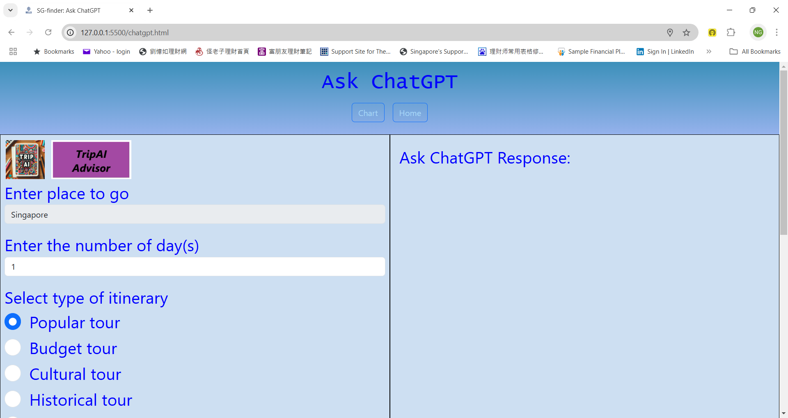

<!-- .md means markdown -->

<!-- README.md -->
<!-- This file documents the information about the portfolio project. -->
<!-- It should be READ ME first!!! -->

<!-- Heading level 1 -->
# BELLS-TGC-IP1
**(SCTP) Full Stack Developer**

Industry Project: **Front-End Development**

***Project Assignment - Portfolio***

<!-- Heading level 3 -->
### Project File Structure:

: README.md

>>> Home page (Landing Page)
: index.html

* HTML Files (hypertext markup language)
: index.html
: home.html
: chart.html
: chatgpt.html

* CSS Folder (cascading style sheets)
: style.css
: chart.css
: chatgpt.css

* IMG Folder (images)
: bells_logo.jpg
: EricNg-linkedin.jpg
: SG-2023-Tourists-Arrivals-Charts.png
: singapore-changi-airport.webp
: SG-finder-SINGAPORE.png
: SINGAPORE-SG-finder.png
: SG-finder-index.png
: SG-finder-home.png
: SG-finder-chart.png
: SG-finder-chatgpt.png
: SG-finder-sidebar.png

* RES Folder (resources)
: bells.ico
: icongreen.png
: markerLocateMe.png
: marker.png
: markerMRT.png
: markerLRT.png
: markerBUS.png
: markerTAXI.png

* LANG Folder (languages)
: en.json
: zh.json

* DATA Folder (data)
: postal sub-folder
: transport sub-folder
: chart sub-folder
: chatgpt sub-folder
: node_modules sub-folder
: convertCsvToJson.js
: package-lock.json
: package.json

* JS Folder (javascript)
: multilang.js
: script.js
: data.js
: view.js
: chart.js
: chatgpt.js

<!-- Heading level 1 -->
# Project Guide
For the purpose of the portfolio project, a landing page is created for the following:

```json
{
1. "SG-finder" : in our case "index.html (just welcome page) redirect to home.html (main page)"
}
```

This project is named ***SG-finder*** for **SINGAPORE**, it also has *TripAI feature*. 

The application of this project caters to the needs of a specific target user group, the Singapore Tourists,
who are finding the places around the visiting country Singapore.

The website provides an one-stop entry point to the Singapore Tourists with the following, namely:

***
1. *Where Are You Locator*
2. *Search by Keyword*
3. *Search by Postal Code*
4. *Quick Search by Category*
5. *Base/Layer Clusters/Markers for Public Transportation*
6. *Chart Analytic for Singapore Visitors*
7. *Ask ChatGPT for Itinerary Recommendations*
***

The web development is done using [Visual Studio Code][3] with responsive design concepts that provide media query breakpoints based on the following screen sizes:

***Bootstrap Breakpoints***
    
| Device(s) | Description | Prefix | Screen Sizes |
| :--- | :---: | :---: | ---: |
| phones | Extra small | None | <576px |
| portrait tablets and large phones | Small | sm | ≥576px |
| landscape tablets | Medium | md | ≥768px |
| laptops/desktops | Large | lg | ≥992px |
| large laptops and desktops | Extra large | xl | ≥1200px |
| large tv screens | Extra extra large | xxl | ≥1400px, max:1580px |


This simple website has a BellsTech logo and navigational bar with Home, Chart, Language, About, Login (disabled) links and buttons like Ask ChatGPT, Reset Map, Locate Me!, input boxes for Keyword Search and Postal Search, and Quick Search dropdown menu in the home page for laptops and sidebar with Language Setting (English and Chinese) and Menu Selection (Reset Map, Locate Me!, Ask ChatGPT and Chart), with Acount (Profile, Settings and Logout) for future implementations.

This provides an inner site navigation bar that allows the user to view the different pages in the site for large devices
(like laptops and TV screens) and sidebar navigation menu for small devices (like phones and tablets).





<!-- Heading level 4 -->
#### The url for the portfolio project is here:

- [Industry Project]
  Because the project contains SECRET KEY for OpenAI ChatGPT feature, it also has to implement a backend (express application) with proxy server in order to deploy onto web site. Due to this issue, the SECRET KEY could not be uploaded into GitHub and the application is now run on local host.

<!-- Heading level 4 -->
#### The source codes is hosted as public on a Github repository and the link is as follows: 

- [Source Codes Github Link](https://www.github.com/ngys9919/bells-tgc-ip1 "My source-codes!")
: Click the hyperlink <https://www.github.com/ngys9919/bells-tgc-ip1>

<!-- Heading level 2 -->
## Features

<!-- Heading level 3 -->
### Existing Features
The user interface is provided by CSS Bootstrap framework. The content is done up with HTML markup language whilst the style for the website is beautified with CSS stylesheets.

Index page:
1. App Logo - to identify the app SG-finder, with CSS animation and alert message 
2. Message - to welcome onboard with simple description of the app in multilingual support according to stored language setting
 
Home page:
1. Logo - to identify the brand of the organization via its logo image
2. Navigation Bars:
   About link - About link: to open modal dialog box

   Login link (disabled) - reserved for future

   html links - SG-finder (navbar-brand): to jump to index.html page\
              - Home link: to jump to home.html page\
              - Chart link: to jump to chart.html page\
              - Ask ChatGPT button: to jump to chatgpt.html page

   buttons - Ask ChatGPT button: to jump to chatgpt.html page\
           - Reset Map button: to reset map and settings to default\
           - Locate Me! button: to find current location on the map

   dropdowns - 
   - Quick Search dropdown: to open-up sub-menu selection for category search like:
            
   0. Reset Quick Search

   1. Normal Category\
      1.1 Embassy or Consulate\
      1.2 Tourist Information and Service\
      1.3 Lodging\
      1.4 Transport Hub\
      1.5 Transportation Service\
      1.6 Travel Agency
   
   2. Emergency Category\
      2.1 Police Station\
      2.2 Fire Station\
      2.3 Emergency Service\
      2.4 Hospital\
      2.5 Healthcare Clinic
   
   - Language dropdown: to open-up sub-menu selection for language setting like:
   1. English
   2. 中文

   search boxes - 
   1. Enter Search Keyword input box with Search button to begin
      To search by keyword strings

   2. Enter Postal Code input box with Locate button to begin
      To search by postal code numbers

1. Search Settings - 
   To modify search settings like the following:
   1. searchLimit (default: 10, min:1, max: 50)
   To limit the number of results for query search strings

   2. searchRadius (default: 2500, min: 0, max: 100000)
   To limit the radius of search location for query strings
   
2. Search Results - 
   To display search results (auto-scrollbar) in bullet form with the following:
   1. Name
   2. Address
   3. Postal Code

3. Map
   Base Layers - 
   1. Clear - to clear the base layers from map
   2. TRANSIT - to show clusters group for MRT and LRT on map

   Overlay Layers - 
   1. BUS Stops - to show cluster for bus stops onto map
   2. LRT Stations - to show cluster for LRT stations onto map
   3. MRT Stations - to show cluster for MRT stations onto map
   4. TAXI Stands - to show taxi stands onto map

   Pop-ups - for keyword search, to pop-up info like Name, Address and Status\
           - for postal code search, to pop-up info like Postal Code and Location\
           - for bus stops, to pop-up info like Bus Stop No. and Location Description\
           - for lrt stations, to pop-up info like Station Code and Station Name\
           - for mrt stations, to pop-up info like Station Code and Station Name\
           - for taxi stands, no pop-up info
  
  Controls - 
   1. Zoom Control - Click + to zoom in, click - to zoom out
   2. Geolocation Control- Click to find current location and zoom into the map, click again to reset
   3. Cluster Control - Click to choose, for Base Layers only select 1 and for Overlay Layers multiple selections available
   4. Scale Control - The scale in metric unit, that is, km
   5. Attribution Control - The attribution for map data, that is, Leaflet / OpenStreetMap

Chart page:
1. CSS Grid - to layout into header, features, charts and summary

2. Header - 
   1. ChatGPT icon - to goto ChatGPT page
   2. Home icon - to return to Home page

3. Features - to briefly describe about Singapore in 2 paragraphs

4. Charts - 
   1. Line Chart -> Tourists Arrivals By Months
   2. Bar Chart -> Tourists Arrivals By Regions

5. Summary - to give data storytelling insights into the charts 


ChatGPT page:
1. Flexbox - to layout using parent-child classes of flex display with flex-direction of row

2. Header - 
   1. Chart icon - to goto Chart page
   2. Home icon - to return to Home page

3. TripAI Advisor - 
   1. Enter place to go (only Singapore)
   2. Enter the number of day(s)
   3. Select type of itinerary:
      3.1 Popular tour
      3.2 Budget tour
      3.3 Cultural tour
      3.4 Historical tour
      3.5 Gourmet-food tour
      3.6 Tertiary institutions tour
   4. Click Send Request button to generate the ChatGPT reply
   5. Click Clear Answer button to reset the ChatGPT reply

4. Tell me more - Click Continue... button to gather more information about your\
                  selected type on places of interests in Singapore

   Top 10 Places of Interests will be listed, with the folowing options for each listing.
   1. Tell me more... button - to ask ChatGPT about the selected place of interests
   2. Check its location button - to map the location of the selected place of interests onto map
   3. Calculate Distance button - to calculate the distance between current location and the selected place of interests


<!-- Heading level 3 -->
### Future Implementation
To deploy into web site using cloud-hosting platform.

<!-- Heading level 2 -->
## Testing
1. Using HTML Validator   
   The html files are checked with W3C Markup Validation Service for any errors through Validate by File Upload method.

   https://validator.w3.org/#validate_by_upload

2. Using CSS Validator   
   The css files are checked with W3C CSS Validation Service for any errors via By file upload method.

   https://jigsaw.w3.org/css-validator/#validate_by_upload

3. Using Test-Cases
   Test-Driven Development (TDD) approach is adopted.\
   Future approach using test automation tools may be explored.

4. Actual Usage   
   4.1 The url is activated in real use-case for laptop (Acer notebook) via browser (Google Chrome).   
   4.2 The url is activated in real use-cases (portrait and auto-rotate) for mobile (Samsung Galaxy smartphone) via browser and short-cut.

<!-- Heading level 2 -->
## Credits

### Acknowledgements
Thanks to Bells for support!

<!-- Heading level 2 -->
## About
> This project work, part of **Industry Project: Front-End Development**, 
> is an individual assessment done by Candidate’s Name (as in NRIC): **Ng Yew Seng** (Candidate’s NRIC: **S XXXX 3 5 3 / F**), 
> a trainee under the **(SCTP) Full Stack Developer** course, organized by **Bells Institute of Higher Learning**. 

>>
>> Coder: ***Ng Yew Seng***\
>> © Copyright 2024\
>> Bells Institute of Higher Learning


<!-- Heading level 2 -->
## Technologies Used
- [x] HTML5
- [x] CSS3
- [x] Bootstrap (v5.3.3) 
- [x] JavaScript for interactivity
- [x] Axios (v1.7.2) for asynchronous functions
- [x] Leaflet for mapping
- [x] FourSquare for Place APIs 
- [x] ApexCharts for charting
- [x] OpenAI for ChatGPT APIs 


<!-- Heading level 2 -->
## References
1.  [Bells Institute of Higher Learning](https://bells.sg)
  
2.  [Microsoft Visual Studio Code](https://code.visualstudio.com)

3.  [Microsoft GitHub](https://www.github.com)

4.  [Bootstrap](https://getbootstrap.com/)
 
5.  [Axios](https://axios-http.com/docs/intro)

6.  [Leaflet](https://axios-http.com/docs/intro)

7.  [FourSquare](https://location.foursquare.com/developer/)

8.  [ApexCharts](https://apexcharts.com/)

9.  [OpenAI](https://openai.com/)


<!-- hyperlinks -->
[1]: https://github.com "GitHub"
