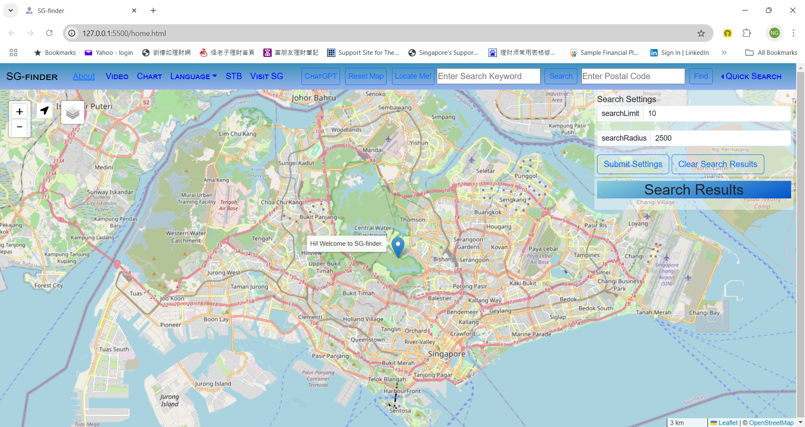
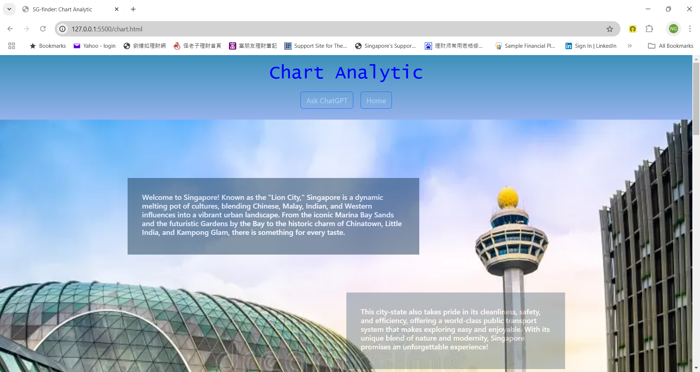

<!-- .md means markdown -->

<!-- README.md -->
<!-- This file documents the information about the portfolio project. -->
<!-- It should be READ ME first!!! -->

<!-- Heading level 1 -->
# BELLS-TGC-IP1
**(SCTP) Full Stack Developer**

Industry Project: **Front-End Development**

***Project Assignment - Portfolio***

<!-- Heading level 3 -->
### Project File Structure:

: README.md

>>> Home page (Landing Page)
: index.html

* HTML Files (hypertext markup language)
: index.html
: home.html
: chart.html
: chatgpt.html

* CSS Folder (cascading style sheets)
: style.css
: chart.css
: chatgpt.css

* IMG Folder (images)
: bells_logo.jpg
: EricNg-linkedin.jpg
: SG-2023-Tourists-Arrivals-Charts.png
: singapore-changi-airport.webp
: SG-finder-SINGAPORE.png
: SINGAPORE-SG-finder.png
: SG-finder-index.png
: SG-finder-home.png
: SG-finder-chart.png
: SG-finder-chatgpt.png
: SG-finder-sidebar.png

* RES Folder (resources)
: bells.ico
: icongreen.png
: markerLocateMe.png
: marker.png
: markerMRT.png
: markerLRT.png
: markerBUS.png
: markerTAXI.png

* LANG Folder (languages)
: en.json
: zh.json

* DATA Folder (data)
: postal sub-folder
: transport sub-folder
: chart sub-folder
: chatgpt sub-folder
: node_modules sub-folder
: convertCsvToJson.js
: package-lock.json
: package.json

* JS Folder (javascript)
: multilang.js
: script.js
: data.js
: view.js
: chart.js
: chatgpt.js

<!-- Heading level 1 -->
# Project Guide
For the purpose of the portfolio project, a landing page is created for the following:

```json
{
1. "SG-finder" : in our case "index.html (just welcome page) redirect to home.html (main page)"
}
```

This project is named ***SG-finder*** for **SINGAPORE**, it also has *TripAI feature*. 

The application of this project caters to the needs of a specific target user group, the Singapore Tourists,
who are finding the places around the visiting country Singapore.

The website provides an one-stop entry point to the Singapore Tourists with the following, namely:

***
1. *Where Are You Locator*
2. *Search by Keyword*
3. *Search by Postal Code*
4. *Quick Search by Category*
5. *Base/Layer Clusters/Markers for Public Transportation*
6. *Chart Analytic for Singapore Visitors*
7. *Ask ChatGPT for Itinerary Recommendations*
***

The web development is done using [Visual Studio Code][3] with responsive design concepts that provide media query breakpoints based on the following screen sizes:

***Bootstrap Breakpoints***
    
| Device(s) | Description | Prefix | Screen Sizes |
| :--- | :---: | :---: | ---: |
| phones | Extra small | None | <576px |
| portrait tablets and large phones | Small | sm | ≥576px |
| landscape tablets | Medium | md | ≥768px |
| laptops/desktops | Large | lg | ≥992px |
| large laptops and desktops | Extra large | xl | ≥1200px |
| large tv screens | Extra extra large | xxl | ≥1400px, max:1580px |


This simple website has a BellsTech logo and navigational bar with Home, Chart, Language, About, Login (disabled) links and buttons like Ask ChatGPT, Reset Map, Locate Me!, input boxes for Keyword Search and Postal Search, and Quick Search dropdown menu in the home page for laptops and sidebar with Language Setting (English and Chinese) and Menu Selection (Reset Map, Locate Me!, Ask ChatGPT and Chart), with Acount (Profile, Settings and Logout) for future implementations.

This provides an inner site navigation bar that allows the user to view the different pages in the site for large devices
(like laptops and TV screens) and sidebar navigation menu for small devices (like phones and tablets).








The website is deployed using [GitHub Pages][1] so that it is available via a public web address.

<!-- Heading level 4 -->
#### The url for the portfolio project is here:

- [Industry Project](https://ngys9919.github.io/bells-tgc-ip1/ "My project-website!")
: Click the hyperlink <https://ngys9919.github.io/bells-tgc-ip1/>

<!-- Heading level 4 -->
#### The source codes is hosted as public on a Github repository and the link is as follows: 

- [Source Codes Github Link](https://www.github.com/ngys9919/bells-tgc-ip1 "My source-codes!")
: Click the hyperlink <https://www.github.com/ngys9919/bells-tgc-ip1>

<!-- Heading level 2 -->
## Features

<!-- Heading level 3 -->
### Existing Features


<!-- Heading level 3 -->
### Future Implementation


<!-- Heading level 2 -->
## Testing
1. Using HTML Validator   
   The html files are checked with W3C Markup Validation Service for any errors through Validate by File Upload method.

   https://validator.w3.org/#validate_by_upload

2. Using CSS Validator   
   The css files are checked with W3C CSS Validation Service for any errors via By file upload method.

   https://jigsaw.w3.org/css-validator/#validate_by_upload

3. Using Test-Cases\
   

4. Actual Usage   
   4.1 The url is activated in real use-case for laptop (Acer notebook) via browser (Google Chrome).   
   4.2 The url is activated in real use-cases (portrait and auto-rotate) for mobile (Samsung Galaxy smartphone) via browser and short-cut.

<!-- Heading level 2 -->
## Credits

### Acknowledgements
Thanks to Bells for support!

<!-- Heading level 2 -->
## About
> This project work, part of **Industry Project: Front-End Development**, 
> is an individual assessment done by Candidate’s Name (as in NRIC): **Ng Yew Seng** (Candidate’s NRIC: **S XXXX 3 5 3 / F**), 
> a trainee under the **(SCTP) Full Stack Developer** course, organized by **Bells Institute of Higher Learning**. 

>>
>> Coder: ***Ng Yew Seng***\
>> © Copyright 2024\
>> Bells Institute of Higher Learning


<!-- Heading level 2 -->
## Technologies Used
- [x] HTML5
- [x] CSS3
- [x] Bootstrap (v5.3.3) 
- [x] JavaScript for interactivity
- [x] Axios (v1.7.2) for asynchronous functions
- [x] Leaflet for mapping
- [x] FourSquare for Place APIs 
- [x] ApexCharts for charting
- [x] OpenAI for ChatGPT APIs 


<!-- Heading level 2 -->
## References
1.  [Bells Institute of Higher Learning](https://bells.sg)
  
2.  [Microsoft Visual Studio Code](https://code.visualstudio.com)

3.  [Microsoft GitHub](https://www.github.com)

4.  [Bootstrap](https://getbootstrap.com/)
 
5.  [Axios](https://axios-http.com/docs/intro)

6.  [Leaflet](https://axios-http.com/docs/intro)

7.  [FourSquare](https://location.foursquare.com/developer/)

8.  [ApexCharts](https://apexcharts.com/)

9.  [OpenAI](https://openai.com/)


<!-- hyperlinks -->
[1]: https://github.com "GitHub"
